# python-slugify

A Python library and command-line tool that converts arbitrary Unicode text into ASCII (or Unicode) URL/filename-safe slugs. It decodes HTML entities, transliterates non-ASCII characters, strips disallowed characters, collapses separators, optionally removes stopwords, applies custom replacement rules, and can truncate the result to a maximum length (optionally at a word boundary). It is used both as an importable `slugify` function and as a `slugify` shell command.

## Architecture

The package exposes a single function, [`slugify()`](slugify/slugify.py), which dispatches to one of two independent pipelines selected by the keyword-only `algorithm` argument:

- **`algorithm='legacy'`** (the permanent default) calls into [`slugify/_legacy.py`](slugify/_legacy.py), a module that is explicitly frozen: "DO NOT MODIFY... Any change to this file that alters legacy output is rejected on principle." Many deployed applications depend on its exact byte-for-byte output, so behavior changes are only ever added to the modern path.
- **`algorithm='modern'`** calls `_modern_slugify` inside [`slugify/slugify.py`](slugify/slugify.py) itself, which opts into fixed-up behavior: entity decoding before transliteration, per-reference numeric-entity handling, snapshotted (non-consumable) replacement/stopword iterables, a length budget measured on emitted characters rather than pre-separator text, and up-front `TypeError`s for bad argument types.

Both pipelines share the same overall stages and are driven by the same public parameters:

```mermaid
flowchart LR
    A[Input str/bytes/bytearray] --> B[Pre-stage replacements]
    B --> C[Decode HTML entities: named, decimal, hex]
    C --> D[Unicode normalize NFKD or NFKC]
    D --> E{allow_unicode?}
    E -- no --> F[Transliterate to ASCII via backend]
    E -- yes --> G[Skip transliteration]
    F --> H[Lowercase, strip quotes/number commas]
    G --> H
    H --> I[Replace disallowed chars with separator]
    I --> J[Collapse duplicate separators, strip ends]
    J --> K[Remove stopwords]
    K --> L[Post-stage replacements]
    L --> M[Truncate to max_length / word boundary]
    M --> N[Map internal '-' to requested separator]
    N --> O[Slug string]
```



The CLI ([`slugify/__main__.py`](slugify/__main__.py)) is a thin `argparse` wrapper: it parses flags into the same keyword arguments accepted by `slugify()`, reads text from positional arguments or `--stdin`, calls `slugify(**params)`, and prints the result.

## Key components

### [`slugify/slugify.py`](slugify/slugify.py)

The public entry point. Defines the `slugify(text, ...)` function and the `Backend`, `ReplacementStage` and `Algorithm` `Literal` type aliases. Key parameters:

- `entities`, `decimal`, `hexadecimal` — control HTML entity decoding (`&amp;`, `&#65;`, `&#x41;`).
- `max_length`, `word_boundary`, `save_order`, `separator` — control truncation and the delimiter used in the output.
- `stopwords`, `regex_pattern` — remove specific words / customize which characters are disallowed.
- `replacements` — an iterable of `(old, new)` literal string-replacement pairs.
- `allow_unicode` — skip ASCII transliteration and keep Unicode characters (NFKC normalization only).
- Keyword-only: `replacement_stage` (`'both'`, `'pre'`, `'post'`) controls when `replacements` are applied; `backend` (`'auto'`, `'text-unidecode'`, `'unidecode'`, `'anyascii'`) selects the transliteration library, with `'auto'` preferring an installed `Unidecode` and falling back to `text-unidecode`; `algorithm` (`'legacy'` default, `'modern'`) selects the pipeline described above.
- Accepts `str`, `bytes` or `bytearray` input; bytes/bytearray are decoded as UTF-8 with invalid bytes ignored. Any other type raises `TypeError`.
- Also re-exports `smart_truncate`, the historical public truncation helper (still character-set-stripping, still raising `ValueError` on an empty separator, still using negative-slicing semantics) — this function's behavior is unchanged regardless of `algorithm`.

### [`slugify/_legacy.py`](slugify/_legacy.py)

The frozen legacy implementation. Contains its own copies of the entity/transliteration/truncation logic (`_decode_entities`, `_transliterate`, `smart_truncate`, `slugify`) so that it can evolve independently of any future modern-path bug fixes. Comments in the module explicitly state it must be verified byte-for-byte against a "frozen 2,688-case differential baseline" before any edit is accepted, and only non-behavioral edits (e.g. docstrings) are allowed.

### [`slugify/special.py`](slugify/special.py)

Optional built-in transliteration tables for pre-processing specific alphabets before the main pipeline runs: `CYRILLIC`, `GERMAN`, `GREEK` (each combined into `PRE_TRANSLATIONS`), built via `add_uppercase_char`, which derives uppercase/capitalized variants of each lowercase replacement pair and inserts them atomically (an insertion failure never partially mutates the input list).

### [`slugify/__main__.py`](slugify/__main__.py)

The `slugify` console script (registered via `[project.scripts]` in [pyproject.toml](pyproject.toml)). `parse_args` builds an `argparse.ArgumentParser` exposing every `slugify()` parameter as a flag (`--no-entities`, `--no-decimal`, `--no-hexadecimal`, `--max-length`, `--word-boundary`, `--save-order`, `--separator`, `--stopwords`, `--regex-pattern`, `--no-lowercase`, `--replacements old->new ...`, `--allow-unicode`, `--algorithm`, `--backend`, `--replacement-stage`), plus positional `input_string` words or `--stdin`. `slugify_params` translates the parsed namespace into the `slugify()` call's keyword arguments, omitting `algorithm`/`backend`/`replacement_stage` unless explicitly passed so the API defaults apply. `main()` prints the result and exits `-1` on `KeyboardInterrupt`.

### [`slugify/__version__.py`](slugify/__version__.py)

Single source of truth for package metadata (`__title__`, `__author__`, `__url__`, `__license__`, `__version__`), consumed by `pyproject.toml`'s `dynamic = ["version"]` setting and re-exported from `slugify/__init__.py`.

### [`tools/`](tools)

Developer/release tooling, not shipped as part of the runtime import path but included in the sdist:

- [`tools/check_algorithms.py`](tools/check_algorithms.py) — reusable API-level differential checks (`check_goldens`, `check_differential`) comparing legacy vs. modern output against a reference implementation; run both from the checkout and against installed release artifacts.
- [`tools/check_dist.py`](tools/check_dist.py) — builds the wheel and sdist with `python -m build`, runs `twine check --strict`, inspects archive contents (license, `py.typed`, entry points, required files), installs each artifact into a fresh venv, and exercises the CLI and Unicode-only runtime (after uninstalling `text-unidecode`) end-to-end.
- [`tools/legacy_reference.py`](tools/legacy_reference.py) — the frozen differential-baseline reference implementation used by the checks above.

### [`docs/release-9/`](docs/release-9)

Migration and verification notes for the 9.x release, including [`migration.md`](docs/release-9/migration.md) (legacy-vs-modern behavior table and application-migration guidance), `historical-review.md`, `recent-review.md` and `verification.md`.

## Getting started

### Requirements

- Python `>=3.10` (CI also runs PyPy 3.11).
- Base dependency: `text-unidecode>=1.3` (installed automatically).

### Installation

```bash
pip install python-slugify
```

Optional transliteration backends, declared as extras in [pyproject.toml](pyproject.toml):

```bash
pip install python-slugify[unidecode]   # Unidecode>=1.1.1 (GPL-licensed)
pip install python-slugify[anyascii]    # anyascii>=0.3.2 (ISC-licensed)
```

`backend='auto'` (the default) prefers an installed `Unidecode` and falls back to `text-unidecode`; pass `backend='unidecode'`, `backend='text-unidecode'` or `backend='anyascii'` to select explicitly (no silent fallback for explicit choices).

### Usage as a library

```python
from slugify import slugify

slugify("Hello, World!")                 # 'hello-world'
slugify("影師嗎")                          # transliterated per installed backend
slugify("影師嗎", allow_unicode=True)       # '影師嗎' (kept as Unicode, no transliteration import needed)
slugify("one two three", stopwords=["two"])   # 'one-three'
slugify("a b c", separator="::", max_length=3)  # 'a::b' (legacy, the default algorithm)
slugify("a b c", separator="::", max_length=3, algorithm="modern")  # 'a'
```

### Usage as a CLI

Installing the package registers a `slugify` command:

```bash
slugify "Hello, World!"
slugify --stdin < input.txt
slugify --max-length 20 --word-boundary --separator _ "Some long title here"
slugify --algorithm modern --backend anyascii "影師嗎"
```

It can also be run without installing the entry point:

```bash
python -m slugify "Hello, World!"
```

Run `slugify --help` for the full flag list, which mirrors every `slugify()` parameter.

### A note on the `legacy` vs. `modern` algorithm

`algorithm='legacy'` is the permanent default and must never change its output; use it for existing applications and persisted slugs (URLs, filenames, database keys). `algorithm='modern'` opts into fixed entity/truncation/iterator behavior described in [docs/release-9/migration.md](docs/release-9/migration.md) — read that document before switching an application over, since it changes output for a range of inputs and there is no `slugify_v2` function to fall back to.

## Development

### Running tests

Tests live under [tests/](tests) (`test_legacy.py`, `test_release.py`, `test_add_uppercase_error.py`) and are run with pytest, configured in `[tool.pytest.ini_options]` in [pyproject.toml](pyproject.toml) (`testpaths = ["tests"]`, warnings promoted to errors):

```bash
pip install -e .
pip install coverage pytest
coverage run --source=slugify -m pytest tests
```

The project uses [tox](tox.ini) to run the full matrix across Python 3.10–3.14 and PyPy 3.11, against each transliteration backend (`unidecode`, `text_unidecode`, `anyascii`):

```bash
tox                       # run every environment
tox -e mypy               # strict mypy over the slugify package
tox -e pycodestyle        # pycodestyle over slugify, tests, setup.py, tools
tox -e flake8             # flake8 over slugify, setup.py, tests, tools
tox -e packaging          # tools/check_dist.py: build, twine check, install, exercise CLI
tox -e coverage-report    # combine coverage from all environments (fail_under = 97)
```

Coverage settings (`[tool.coverage.*]`) require branch coverage and fail under 97%. Mypy runs in `strict` mode against the `slugify` package (`[tool.mypy]`).

### Linting/formatting

[`format.sh`](format.sh) runs `pycodestyle` with the same ignore list used in CI/tox:

```bash
pycodestyle --ignore=E128,E261,E225,E501,W605 slugify test.py setup.py
```

### CI

GitHub Actions workflows in [.github/workflows/](.github/workflows): [`ci.yml`](.github/workflows/ci.yml) runs on the `ci`/`staging` branches across Python 3.10–3.14 and PyPy 3.11, installing the package editable, running `flake8`, `pycodestyle`, `pytest` under `coverage`, and reporting to Coveralls. `dev.yml` and `main.yml` provide additional workflow triggers (see [.github/workflows/](.github/workflows)).

### Release verification

`python tools/check_dist.py [--outdir DIR]` builds both the wheel and sdist, validates metadata (`Name`, `Version`, `Requires-Python`, `License-Expression`, extras), checks required files are present in each artifact (license, `py.typed`, tests, docs, tools), installs each artifact into a fresh virtual environment, and runs the CLI and API checks against the installed code only — without publishing or tagging anything.

## Project layout

```text
.
├── slugify/
│   ├── __init__.py       # re-exports slugify(), smart_truncate, special.* and package metadata
│   ├── __main__.py       # `slugify` console script / `python -m slugify`
│   ├── __version__.py    # single source of truth for package metadata/version
│   ├── _legacy.py         # frozen legacy pipeline; DO NOT MODIFY behavior
│   ├── slugify.py         # public slugify() entry point + modern pipeline
│   ├── special.py         # Cyrillic/German/Greek pre-translation tables
│   └── py.typed           # PEP 561 typed-package marker
├── tests/
│   ├── test_legacy.py             # legacy-pipeline behavior tests
│   ├── test_release.py            # release/artifact-level tests
│   └── test_add_uppercase_error.py# special.add_uppercase_char atomicity test
├── tools/
│   ├── check_algorithms.py  # golden + differential API checks (used pre- and post-install)
│   ├── check_dist.py        # build/inspect/install/exercise wheel & sdist
│   └── legacy_reference.py  # frozen differential-baseline reference implementation
├── docs/release-9/           # 9.x migration notes, historical/recent review, verification evidence
├── .github/workflows/        # ci.yml, dev.yml, main.yml GitHub Actions
├── pyproject.toml            # project metadata, dependencies, extras, tool config (pytest/coverage/mypy)
├── setup.py                  # compatibility shim; config lives in pyproject.toml
├── tox.ini                   # multi-version/backend test matrix, mypy, pycodestyle, flake8, packaging
├── format.sh                 # pycodestyle formatting check
├── CHANGELOG.md              # per-release notes
└── LICENSE                   # MIT
```
